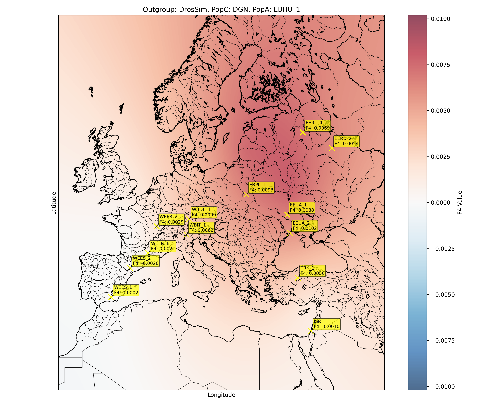
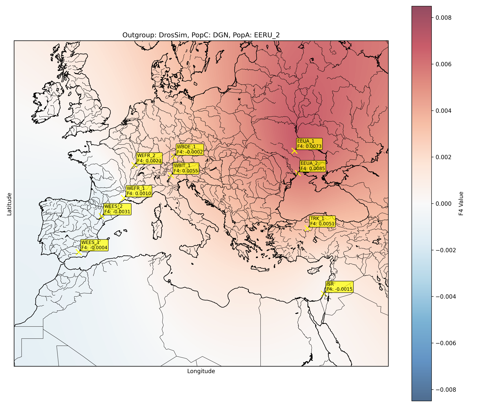
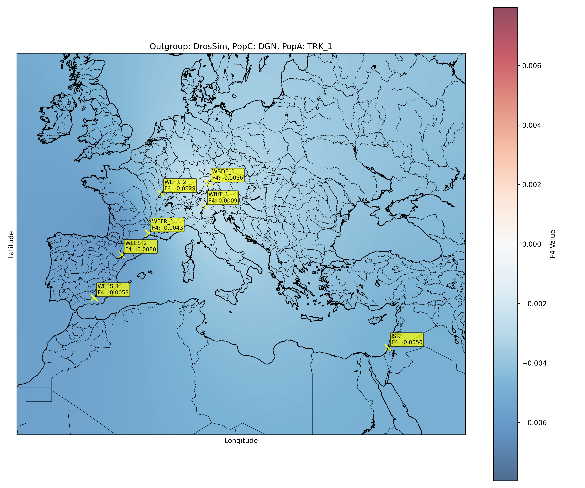
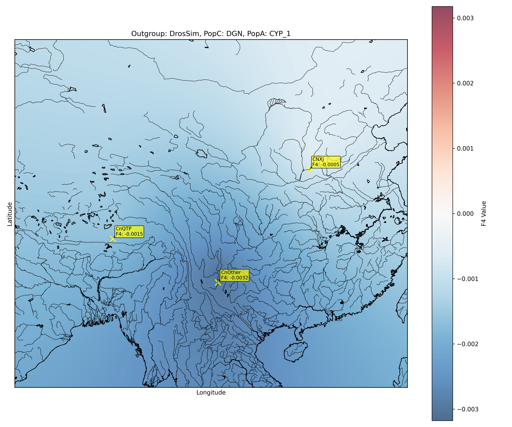
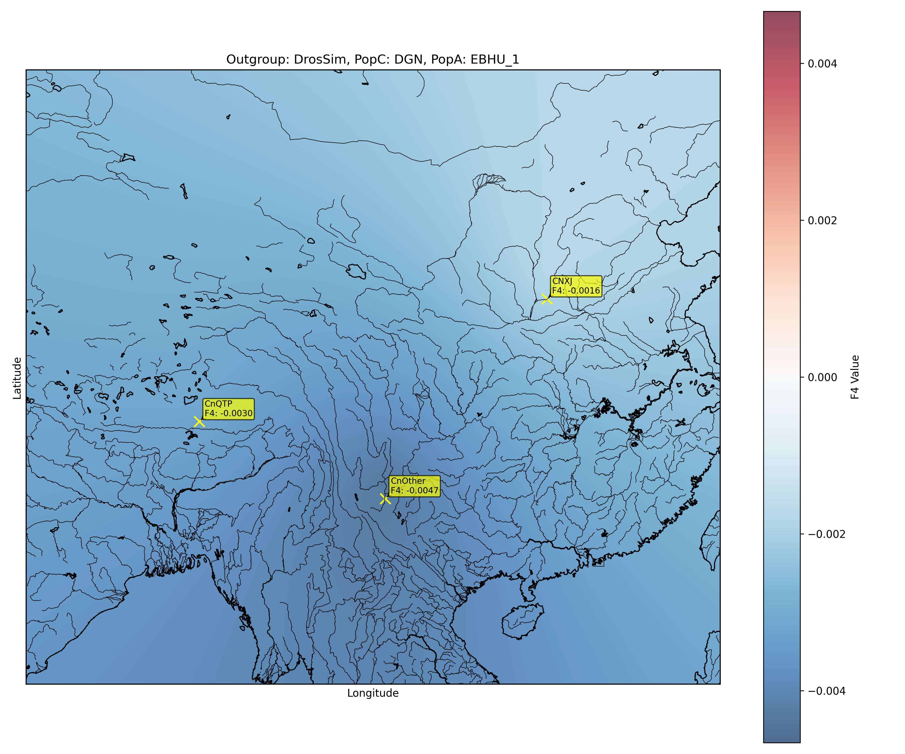
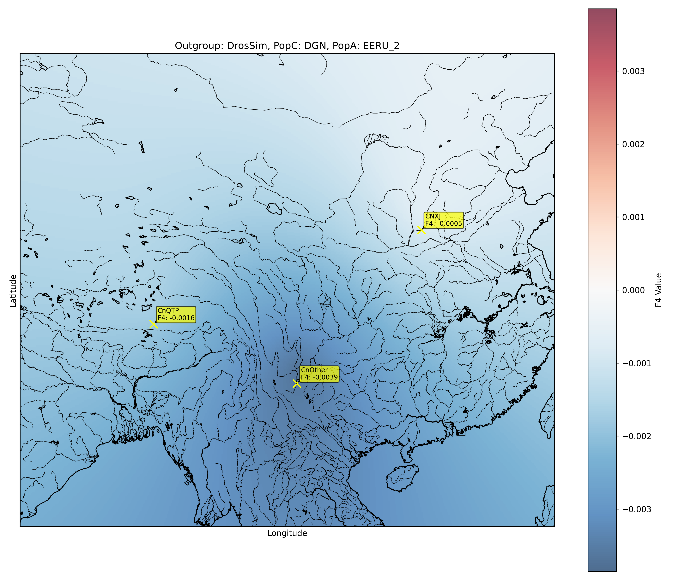

# Unraveling the shared evolutionary history of European humans and Drosophila melanogaster
## Bachelor's thesis project by Astra Bertelli

**Supervisors**: Martin Kapun, Lino Ometto

**Collaborators**: Alan Bergland, Arnoud Estoup, Stefan Eichert, Mathieu Gautier, Joaquin Nunez

This repository collects the data, the code and the analysis workflow for the project.

## Environment

There are two possibilities to launch the development environment packaged for this project:

### 1. Native `conda` environments

>[!NOTE]
> _Recommended for compatibility with all operating systems_ 

Use the native conda environments installation:

```bash
# clone the repository
git clone https://github.com/AstraBert/drosophila-evolution.git
cd drosophila-evolution
# set up conda environments
bash setup.sh
```

`setup.sh` will create five conda enviroments:

- **gatk_modified**: contains all GATK dependencies, but also bwa-mem2, cutadapt, bcftools and samtools
- **picard**: contains picard-slim a lighter implementation of Picard which does not require r-base to run
- **R**: contains r-base platform for data analysis in R and the various R libraries (like poolfstat)
- **python_deps**: contains python3.11 and various libraries like pandas, biopython, pyyaml.
- **freebayes-env**: contains freebayes to run variant calling, and other useful dependencies such as GNU parallel

### 2. Dockerized environment

> [!IMPORTANT]
> _Not built for ARM64-based OS_ 

You can either pull the image `astrabert/drosophila-evolution-dockerized` and run it interactively mounting a volume:

```bash
sudo docker pull astrabert/drosophila-evolution-dockerized
sudo docker run -v /path/to/local/folder:/app/userdata/ -it astrabert/drosophila-evolution-dockerized
```

Or you can clone this repository and exploit *docker compose* to launch the container:

```bash
# clone the repository
git clone https://github.com/AstraBert/drosophila-evolution.git
cd drosophila-evolution
# launch docker compose
sudo docker compose up
```

Or, if you would like even more automation and you are on a Linux OS:

```bash
# launch a docker container through a normal docker run
bash run_docker.sh
# launch a docker container through compose
bash compose.sh
```

The container in which the docker image will run will have the same conda environments that you would obtain from the native installation. 

> [!NOTE]
> _If you want to use these two last solutions, you should manually modify the path of the local file system mounted as a volume in the container in [run_docker.sh](./run_docker.sh) or modify the `USERDATA_PATH` variable in [.env](./.env)_

# Analysis workflow

Find all the steps of the workflow in [MAIN.sh](./shell/MAIN.sh).

**Set your working directory**: Set the working repository so that it matches your local file system:

```bash
wd="/gatk_modified/userdata/abertelli/drosophila-evolution/"
```

### Data getting workflow

<div align="center">
    
    <p><i>Workflow for getting needed data</i></p>
    <sbr>
</div>

**Getting the reference genome and index it**: Download the latest release of _Drosophila melanogaster_'s genome from [FlyBase]() and index it with `samtools`+`bwa-mem2`:

```bash
## GET THE REFERENCE GENOME FOR D. melanogaster FROM FlyBase
mkdir -p $wd/data/reference/

cd $wd/data/reference/

wget -O dmel-6.59.fa.gz https://ftp.flybase.net/genomes/Drosophila_melanogaster/current/fasta/dmel-all-chromosome-r6.59.fasta.gz

## INDEX THE REFERENCE GENOME
bwa-mem2 $wd/data/reference/index dmel-6.59.fa.gz
gunzip -c $wd/data/reference/dmel-6.59.fa.gz >$wd/data/reference/dmel-6.59.fa
samtools faidx $wd/data/reference/dmel-6.59.fa
samtools dict $wd/data/reference/dmel-6.59.fa >$wd/data/reference/dmel-6.59.dict
```

**Get already mapped data files**: The DGN data were available from local storage. DESTv2 data can be instead downloaded from the database using `wget`:

```bash
## DOWNLOAD FOUR EASTERN EUROPEAN AND FOUR WESTERN EUROPEAN SAMPLES FROM DESTv2
cd $wd/data/bamfiles/

while IFS= read -r url; do
    wget "$url" 
done < $wd/data/bam_download_link.txt

## DOWNLOAD ADDITIONAL EASTERN EUROPEAN AND WESTERN EUROPEAN SAMPLES FROM DESTv1 AND DESTv2
cnt=0
mkdir $wd/shell/wget_data/

while IFS= read -r url; do
    ((cnt++))
    echo "wget "$url"" > $wd/shell/wget_data/${cnt}.sh 
done < $wd/data/additional_dest_bams.txt

source activate freebayes-env
echo "will cite" | parallel --citation >/dev/null 2>&1
parallel --bar -j 100 bash ::: $wd/shell/wget_data/*.sh
conda deactivate
```

### Mapping data pipeline

<div align="center">
    
    <p><i>Raw sequencing data mapping pipeline</i></p>
    <sbr>
</div>

**Get the raw sequencing data and map them**: Store all the SRA accessions in specific files and subsequently use them to get the data either through `prefetch`+`fasterq-dump`. Use the [mapping_pipeline.sh](./shell/mapping_pipeline.sh) script to map them on the fly. 

```bash
for sg in CN_XJ CnOther CnQTP ISR_1 ISR_2
do
    outp=${wd}/data_files/${sg}
    
    mkdir -p $outp
    
    cd $outp

    input_file=${wd}/download_${sg}.txt 

    while IFS= read -r accession; do
        echo "Downloading and processing: $accession"
        
        # Download the SRA file
        prefetch "$accession"
        
        mkdir -p ${wd}/data/mapping/${sg}/${accession}

        # Convert the SRA file to FASTQ format
        fasterq-dump -e 50 --split-files "$accession"
        pigz -p 50 ${wd}/data_files/${sg}/${accession}_1.fastq
        pigz -p 50 ${wd}/data_files/${sg}/${accession}_2.fastq
        rm -rf ${wd}/data_files/${sg}/${accession} 
        bash $wd/shell/mapping_pipeline.sh \
            -fq1 ${wd}/data_files/${sg}/${accession}_1.fastq \
            -fq2 ${wd}/data_files/${sg}/${accession}_2.fastq \
            -r ${wd}/data/reference/dmel-6.59.fa.gz \
            -o ${wd}/data/mapping/${sg}/${accession} \
            -t 50
    done < "$input_file"
done

## RETAIN ONLY THE BAM FILES AND MOVE THEM
rm -rf ${wd}/data_files/
mkdir ${wd}/data/bamfiles
mv ${wd}/data/mapping/*/*.bam* ${wd}/data/bamfiles
```

### Processing the data

**Preprocessing the data**: We preprocessed the data modifying the naming in order for them to match with the population from which they're coming from. 

```bash
conda activate python_deps

## RENAME BAM FILES IN ORDER TO MATCH WITH THEIR ORIGINAL POPULATION
python3 $wd/scripts/python/RenameBamFiles.py

## RENAME SAMPLES FROM DESTv2 ACCORDING TO WHAT DID BEFORE
python3 $wd/scripts/python/RenameDestSamples.py

## RENAME ADDITIONAL SAMPLES FROM DESTv1/DESTv2 ACCORDING TO WHAT DID BEFORE
python3 $wd/scripts/python/RenameAdditionalDest.py

conda deactivate

counter=0
for f in $wd/data/DGN/*.bam
do
    ((counter++))
    mv $f $wd/data/bamfiles/DGN_${counter}.bam
done
```

**Adjusting the RG line in DGN BAM files and indexing them**: The `@RG` line in the DGN BAM files either reports `sample` as `SM` tag. In order to avoid confusion in the variant calling process, substitute the `@RG` line using `samtools` and custom python scripts:

```bash
for n in {1..165} 
do
    f="$wd/data/bamfiles/DGN_${n}.bam"
    fres="$wd/data/dgn_renamed/DGN_${n}.bam"

    source activate python_deps

    rgline=$(python3 $wd/scripts/python/ExtractRgLineText.py -i $f)
    rgid=$(python3 $wd/scripts/python/ExtractIdFromRgLine.py -rgl "$rgline")

    conda deactivate

    source activate gatk_modified

    samtools addreplacerg --threads 100 -r "$rgline" -w -o $fres $f
    samtools index -@ 100 $fres

    conda deactivate
done

## REMOVE THE UNUSED DIRECTORIES
rm -rf $wd/data/bamfiles/DGN_*.bam
mv $wd/data/dgn_renamed/*.bam* $wd/data/bamfiles/
rm -rf $wd/data/dgn_renamed/
```

**Adjusting the RG line in DEST BAM files and indexing them**: The `@RG` line in the DEST BAM files reports `sample_name` as `SM` tag. In order to avoid confusion in the variant calling process, substitute the `@RG` line using `samtools` and custom python scripts:

```bash
mkdir -p $wd/data/dest_renamed/

for sample in EERU EEUA WEES WEFR
do
    for n in 1 2
    do 
        f="$wd/data/bamfiles/${sample}_${n}.bam"
        fres="$wd/data/dest_renamed/${sample}_${n}.bam"

        source activate python_deps

        rgline=$(python3 $wd/scripts/python/RgLineForDest.py -i $f)

        conda deactivate

        source activate gatk_modified

        samtools addreplacerg --threads 100 -r "$rgline" -w -o $fres $f
        samtools index -@ 100 $fres

        conda deactivate
    done
done

mkdir -p $wd/data/add_dest_renamed/


for sample in EBAT WBIT EBPL WBDE EBHU CYP TRK
do
    for n in 1
    do 
        f="$wd/data/bamfiles/${sample}_${n}.bam"
        fres="$wd/data/add_dest_renamed/${sample}_${n}.bam"

        source activate python_deps

        rgline=$(python3 $wd/scripts/python/RgLineForDest.py -i $f)

        conda deactivate

        echo $rgline
        source activate gatk_modified

        samtools addreplacerg --threads 100 -r "$rgline" -w -o $fres $f
        samtools index -@ 100 $fres

        conda deactivate
    done
done

rm -rf $wd/data/bamfiles/EE??_?.bam*
rm -rf $wd/data/bamfiles/WE??_?.bam*
rm -rf $wd/data/bamfiles/WB??_?.bam*
rm -rf $wd/data/bamfiles/EB??_?.bam*
rm -rf $wd/data/bamfiles/CYP_?.bam*
rm -rf $wd/data/bamfiles/TRK_?.bam*
mv $wd/data/dest_renamed/*.bam* $wd/data/bamfiles/
mv $wd/data/add_dest_renamed/*.bam* $wd/data/bamfiles/
rm -rf $wd/data/dest_renamed/
rm -rf $wd/data/add_dest_renamed/
``` 


**Preparing the input for FreeBayes and BCFTools**: Create a file with the list of all the BAM files we have:

```bash
for f in $wd/data/bamfiles/*.bam
do
    echo $f >> $wd/data/freebayes_inputs/bamfiles.txt
done
```

### Variant calling

**Variant calling with BCFtools**: Use `bcftools` to perform variant calling on the data (useful for comparison between the two methods, but also faster then FreeBayes and so easier to get the data). Parallelize the variant calling duividing it on different chromosomes and spawn it on different threads with `GNU parallel`:

```bash
source activate freebayes-env
echo "will cite" | parallel --citation >/dev/null 2>&1
parallel --bar -j 40 bash ::: $wd/shell/bcftools_regions/*.sh
conda deactivate
```

This is a code snippet for the variant calling command:

```bash
wd=/gatk_modified/userdata/abertelli/drosophila-evolution

source activate gatk_modified
bcftools mpileup \
    -C 50 \
    -Ou \
    -f $wd/data/reference/dmel-6.59.fa \
    -b $wd/data/freebayes_inputs/bamfiles.txt \
    -q 20 \
    -Q 20 \
    -r "2L" \
    -a DP,AD | bcftools call -mv -Oz --format-fields GQ,GP > $wd/results/drosophila_evolution.bcftools_2L.vcf.gz
conda deactivate
```

### Pseudo-poolification

Pseudo-poolification was performed with a random allele sampling approach (refer to the image for a visualization):

- We considered individuals from the same population
- For each SNP, we randomly sampled the alternative or the reference allele from a list of alleles inferred from the sample field in the VCF
- From the resulting list of randomly sampled allele, we reconstructed the VCF sample field for the entire population for each SNP


This is all implemented within the following command:

```bash
## PSEUDO-POOLIFICATION

source activate python_deps

python3 $wd/scripts/python/RandomAlleleFromVcf.py

conda deactivate

## CONVERSION TO VCF

head -n 1901 > $wd/results/drosophila_evolution.bcftools_fakepools_wholegen.vcf
cat $wd/results/fake_pools_all.tsv.gz >> $wd/results/drosophila_evolution.bcftools_fakepools_wholegen.vcf

source activate gatk_modified

bcftools view -O z -o $wd/results/drosophila_evolution.bcftools_fakepools_wholegen.vcf.gz $wd/results/drosophila_evolution.bcftools_fakepools_wholegen.vcf

conda deactivate
```

### F-stats Computation

>[!IMPORTANT]
> _F-stats_ were calculated without and with the addition of a _Drosophila simulans_ sample from the DEST dataset

**F-stats without _D. simulans_** -> Random allele PCA, pairwise divergence and Fst

They were calculated with the simple poolfstat-based R code in [FstatsWoDrosSim.r](./scripts/r/FstatsWoDrosSim.r):

```R
require(poolfstat)

all.pops.data <- vcf2pooldata(vcf.file="/gatk_modified/userdata/abertelli/drosophila-evolution/results/drosophila_evolution.bcftools_fakepools_wholegen.vcf.gz", min.maf="0.05", poolsizes=rep(100000,20))

save(all.pops.data, file="/gatk_modified/userdata/abertelli/drosophila-evolution/results/all_pops_data.RData")
```

**F-stats with _D. simulans_** -> F4 statistics

The _Drosophila simulans_ sample was added with the following poolfstat-based R code:

```R
require(poolfstat)

load("/gatk_modified/userdata/abertelli/drosophila-evolution/results/all_pops_data.RData") # -> all.pops.data

dros.sim.df <- read.csv("/gatk_modified/userdata/abertelli/drosophila-evolution/results/drossim_snps.csv")
dros.sim.column <- dros.sim.df[,1]
all.pops.count <- cbind(all.pops.data@refallele.readcount)
colnames(all.pops.count) <- NULL
all.pops.data@refallele.readcount <- all.pops.count
all.pops.data@poolsizes <- rep(1000,21)  
all.pops.data@poolnames <- c(all.pops.data@poolnames, "Pool21")
all.pops.data@npools <- 21
all.pops.cov <- all.pops.data@readcoverage
all.pops.cov <- cbin(all.pops.cov, dros.sim.column)
colnames(all.pops.cov) <- NULL
all.pops.data@readcoverage <- all.pops.cov
```
And then the f-statistics were calculated with:

```R
all.pops.fstats <- compute.fstats(all.pops.data, nsnp.per.bjack.block = 1000, computeDstat = TRUE,verbose=TRUE)
save(all.pops.fstats, file="results/all_pops_fstats_wsim.RData")    
```

### Divergence and FST

> [!NOTE]
> Without *Drosophila simulans*

Pairwise divergence and Fst were simply inferred and represented from the F-stats derived by the `all.pops.data` object previously calculated, with the following code:

```R
png("divergence_fst_heatmap.png", width=1000, height=1000)

require(ComplexHeatmap)
load("/gatk_modified/userdata/abertelli/drosophila-evolution/results/all_pops_data.RData") # -> all.pops.fstats 
poolcsv <- read.csv("/gatk_modified/userdata/abertelli/drosophila-evolution/results/pools.csv")
hm.fst <- all.pops.fstats@pairwise.fst
rownames(hm.fst) <- poolcsv$NAME
colnames(hm.fst) <- poolcsv$NAME

hm.div <- all.pops.fstats@pairwise.div
rownames(hm.div) <- poolcsv$NAME
colnames(hm.div) <- poolcsv$NAME

div.hm <- Heatmap(hm.div, cluster_rows = TRUE, cluster_columns=TRUE, name="Divergence (pairwise)", show_heatmap_legend=FALSE, column_title="Divergence (1-Q2)")
fst.hm <- Heatmap(hm.fst, cluster_rows=TRUE, cluster_columns=TRUE, name="values", column_title = "fst=(Q1-Q2)/(1-Q2)")
div.hm+fst.hm
dev.off()
```

Here is the plot:


### Random Allele PCA

Random allele PCA was obtained similarly to the Fst and the Divergence, just by perfoming a PCA on the pooldata object and plotting the first vs the second component:

```R
load("/gatk_modified/userdata/abertelli/drosophila-evolution/results/all_pops_data.RData") # -> all.pops.data

poolcsv <- read.csv("/gatk_modified/userdata/abertelli/drosophila-evolution/results/pools.csv")

png("randomallele.png", width=1000, height=1000)

all.pops.pca <- randomallele.pca(all.pops.data)

pc1_2 <- all.pops.pca$pop.loadings[,c(1,2)] 
rownames(pc1_2) <- poolcsv$NAME

perc.pc1 <- all.pops.pca$perc.var[[1]] 
perc.pc2 <- all.pops.pca$perc.var[[2]] 

perc.pc1.rounded <- round(perc.pc1, digits=2)
perc.pc1.str <- paste0(perc.pc1.rounded)
xlabel <- paste("PC1", "(", perc.pc1.str, "%)")

perc.pc2.rounded <- round(perc.pc2, digits=2)
perc.pc2.str <- paste0(perc.pc2.rounded)
ylabel <- paste("PC2", "(", perc.pc2.str, "%)")

plot(pc1_2[,1], pc1_2[,2], xlab = xlabel, ylab = ylabel, main = "Random Allele PCA", pch = 19, col = "red")
text(pc1_2[,1], pc1_2[,2], labels = rownames(pc1_2), cex = 0.8, pos = 4)

dev.off()
```


### Kriging

Kriging interpolation of F4 statistics values for the populations was obtained by firstly downloading all the F4 statistics from R, manipulating the resulting table programmatically (not showed) into a neat TSV, and then plotting them with the `pykrige` and `basemap` python packages:

```bash
## KRIGING INTERPOLATION

conda activate python_deps

python3 $wd/scripts/python/KrigingWithMap.py

conda deactivate
```

Remember to change lines 8-11 if you want different populations:

```python
p1 = "DrosSim"
p2 = "DGN"
p3 = "WEES_1"
continent = "AS"
```

Use this image, from [Lipson,2020](https://doi.org/10.1111/1755-0998.13230), as reference:


And consider:

- `p1` as A
- `p2` as B
- `p3` as D
- `"AS"` stands for Asia, `"EU"` stands for Europe, and indicates the continent on which you want to see the kriging interpolation

**These are te resulting images for Europe**:









**These are te resulting images for Asia (China)**:








